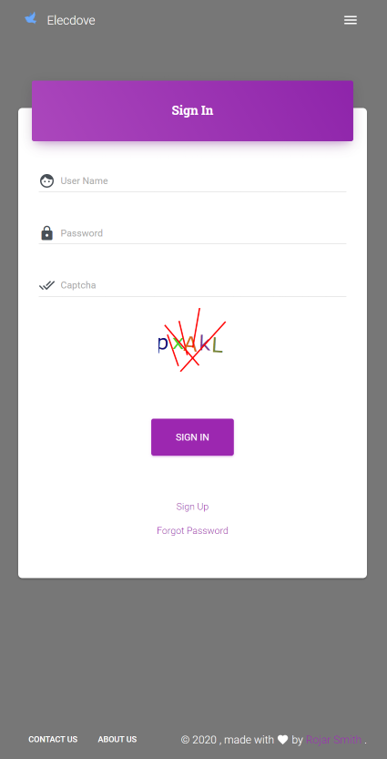

# Elecdove Web

The front-end of e-comm written in ReactJS.

 

2020/10/8 Sign In page can work. 

## Run Production

```bash
# Using config file.
pm2 start ecosystem.config.js --env production

# Manully.
npm run build --spa
pm2 serve -s build 3010
```

## Unit Test

```powershell
# Windows.
# Test with filter.
npm test -- -t 'auth'
```

## Deploy

```bash
# Using GitBash at Windows.
# Compile at remote side maybe cost a lots of time, just wait if web service not update.
pm2 deploy ecosystem.config.js production --force
```

## Developer

Rojar Smith